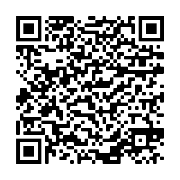

# Experiments for the Arduino Nano 33 Sense board.
[Physics Reimagined](https://hebergement.universite-paris-saclay.fr/supraconductivite/?lang=en) created the [general idea](https://hebergement.universite-paris-saclay.fr/supraconductivite/projet/arduino_nano/?lang=en).

Their experiments are available in the directory `./hebergement.universite-paris-saclay.fr/`.

Top-level experiments are custom by me. I modified the arduino code in `./nano_phyphox_v1/` to add them.

## QR-Codes
### Allgemeine Gasgleichung

### Senkrechter Wurf

### All from Physics Reimagined
